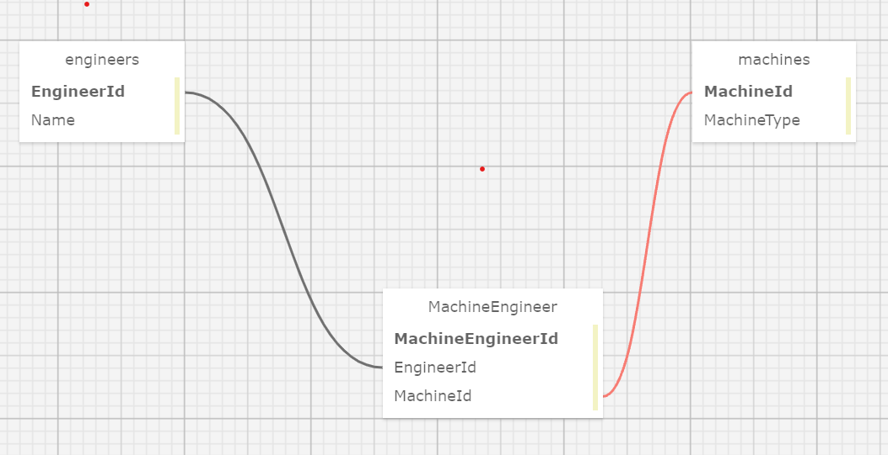

# Dr. Sillystringz's Factory

The factory of the famous Dr. Sillystringz to build an application to keep track of their machine repairs. This MVC web application is to manage their engineers, and the machines they are licensed to fix. The factory manager should be able to add a list of engineers, a list of machines, and specify which engineers are licensed to repair which machines. There should be a many-to-many relationship between Engineers and Machines. An engineer can be licensed to repair (belong to) many machines (such as the Dreamweaver, the Bubblewrappinator, and the Laughbox) and a machine can have many engineers licensed to repair it.

User Stories:-

* As the factory manager, I need to be able to see a list of all engineers, and I need to be able to see a list of all machines.
* As the factory manager, I need to be able to select a engineer, see their details, and see a list of all machines that engineer is licensed to repair. I also need to be able to select a machine, see its details, and see a list of all engineers licensed to repair it.
* As the factory manager, I need to add new engineers to our system when they are hired. I also need to add new machines to our system when they are installed.
* As the factory manager, I should be able to add new machines even if no engineers are employed. I should also be able to add new engineers even if no machines are installed
* As the factory manager, I need to be able to add or remove machines that a specific engineer is licensed to repair. I also need to be able to modify this relationship from the other side, and add or remove engineers from a specific machine.
* I should be able to navigate to a splash page that lists all engineers and machines. Users should be able to click on an individual engineer or machine to see all the engineers/machines that belong to it.

## Name of Author:

   _Smita_

## Technologies used:

* C#

* MySQL

* MySQL Workbench

* .NET 5 SDK

* Git BASH

* ASP .NET CORE MVC

* My SQL Designer

    

## Setup/Installation Requirements

1. Download or clone the [https://github.com/smita-raj12/Factory.Solution](https://github.com/smita-raj12/Factory.Solution) to your local machine.

2. Download any Code Editor for your choice. (Here I used VSCode).

3. Open git BASH terminal and navigate to the Factory folder, within the directory
Run `dotnet restore` in the git BASH terminal to install dependencies. 

4. Create Migrations(run command `dotnet ef migrations add Initial`) on your terminal.

5. Run `dotnet ef database update` to create database.

6. Create appsettings.json file in the Factory directory of Factory.Solution (run the command touch appsettings.json) and add the following code to the file: appsettings.json

      
        {                                                    
         "ConnectionStrings":{                                                          
            "DefaultConnection": "Server=localhost;Port=3306;database=factory;uid={YOUR-USER-NAME};pwd= {YOUR-PASSWORD};"                                        
          }                                                                                
        }                                                                               

6. Remove the {YOUR_USERNAME_NAME} and {YOUR_PASSWORD} and fill in the the code snippet with your username for MySQL, and MySQL password Do not include the curly brackets in your code snippet of appsettings.json

7. Run "dotnet build" in the git BASH terminal to build, and run the project in the terminal. $ dotnet watch run

8. View the website by visiting localhost:5000/ in a new web browser( such as google chrome) tab!

## Known bugs

None 

## License information with a copyright and date:

 [MIT](https://opensource.org/licenses/MIT)

## Contact information:
   
* EmailId: smita.raj12@gmail.com

